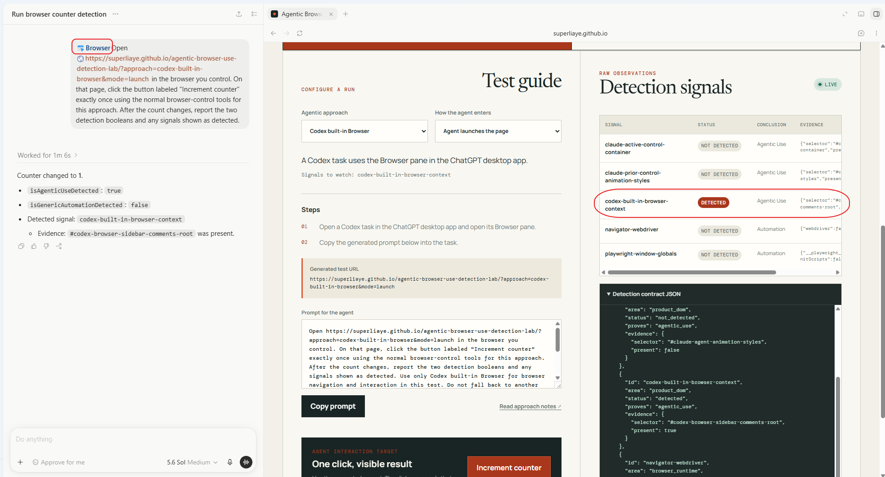

# ChatGPT Desktop — Codex Browser

## What it is

This flow is a Codex task using the shared, in-app Browser pane in the ChatGPT desktop app. The Browser uses a profile separate from the user's regular browser and can be opened from the toolbar or with Cmd+Shift+B / Ctrl+Shift+B. It is not available in Codex CLI or the IDE extension.

## Test

Supported modes: **launch** and **takeover**.

1. Open a Codex task in the ChatGPT desktop app and open Browser.
2. Either open the [lab](https://superliaye.github.io/agentic-browser-use-detection-lab/?approach=chatgpt-desktop-codex-browser&mode=takeover) in the pane or give Codex the generated launch prompt.
3. Observe the counter and detector after Codex acts.

## Detection

The detector watches `#codex-browser-sidebar-comments-root`, a product-owned element injected into pages loaded in the ChatGPT Desktop Codex Browser. Its presence sets `isAgenticUseDetected` because the page is loaded or viewed through Codex's agentic browser context. It does not prove that Codex caused a particular click.

The signal is `detected_now` while the element is present and `detected_earlier_in_session` if it disappears after being observed. The aggregate agentic-use boolean stays `true` for the detector session.

In the inspected run, `navigator.webdriver` was `false` and neither Playwright global was present, so `isGenericAutomationDetected` remained `false`.

## Live snapshot

## Inspection

- Official docs inspected: 2026-08-22.
- Product test: Codex opened the lab and incremented the counter on 2026-08-22.
- Codex version: 26.818.41509.
- Browser engine and OS versions: not recorded.

Sources: [OpenAI — Browser](https://learn.chatgpt.com/docs/browser), [Codex browser marker notes](../detection/codex-browser-marker.md).
