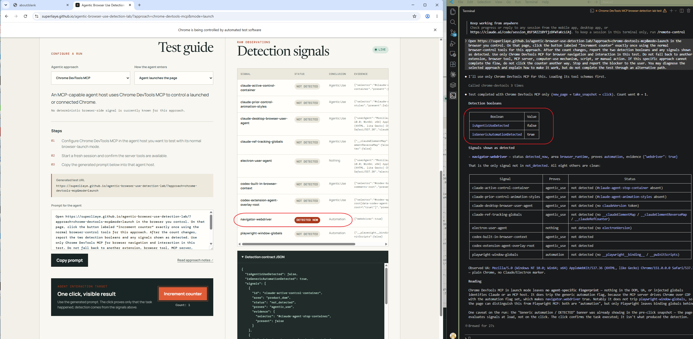

# Chrome DevTools MCP

## What it is

Google's Chrome DevTools MCP server lets any compatible agent host inspect and automate a launched Chrome or connect to an existing remote-debugging instance. Claude Code and Codex are setup examples; the browser-side detection problem belongs to the server and connection mode rather than the selected model.

## Test

Supported modes: **launch** and **takeover**.

1. Configure `chrome-devtools-mcp@latest` in the Claude Code or Codex host you want to test.
2. For launch, use its default browser mode. For takeover, start a separate Chrome with remote debugging and configure the server's browser URL.
3. Start a fresh session and give the host the prompt from the selected [lab flow](https://superliaye.github.io/agentic-browser-use-detection-lab/?approach=chrome-devtools-mcp&mode=launch).

The generated prompt makes the cooperative WebMCP handshake optional. For server 1.7.0 launch mode, add `--category-experimental-webmcp=true` and `--chrome-arg=--enable-features=WebMCP`; this requires Chrome 150 or newer. In takeover mode, enable the same server category and start Chrome with `--enable-features=WebMCP`. If `execute_webmcp_tool` or the page tool is unavailable, the prompt continues through the normal Chrome DevTools MCP click flow without changing controllers.

## Detection

Normal CDP control does not identify a model or agent host. In the default launch inspected with Claude Code, `isAgenticUseDetected` remained `false` while `isGenericAutomationDetected` became `true`. `navigator-webdriver` had status `detected_now` and evidence `{ "webdriver": true }`. This proves generic browser automation only; it does not attribute that automation to Claude Code, Chrome DevTools MCP, or another host or controller.

The controlled click changed the counter from 0 to 1 and produced a trusted mouse `pointerdown` with active buttons and pressure `0`. The lab reports that input as `cdp-zero-mouse-pressure`, but the signal proves nothing and changes neither aggregate boolean. It is an observed input-stack artifact, not proof of CDP, Chrome DevTools MCP, or agentic use. The user agent exposed the Chrome token `Chrome/151.0.0.0` and contained no Claude or Electron token; the full browser version was not recorded.

The lab also performs one best-effort Runtime console-serialization check. When its side effect fires, `cdp-runtime-serialization-observer` displays “CDP/DevTools observer detected; operator unknown.” The signal can also fire for manually opened DevTools or another Runtime-enabled CDP client, can miss CDP clients that do not enable Runtime, and changes neither aggregate boolean.

Two opt-in page-tool paths can provide deterministic agentic evidence:

- Invoking the page's `agentic_use_detection_handshake` through `execute_webmcp_tool` creates a cooperative marker and sets `isAgenticUseDetected`. This is explicit disclosure, not fingerprinting.
- Chrome DevTools MCP's separate experimental third-party tool discovery creates `window.__dtmcp` in the page's main world after the page exposes a `devtoolstooldiscovery` tool group. The lab detects that bridge independently. Server 1.7.0 requires `--category-experimental-third-party=true` for those tools.

Neither opt-in path is required for the default launch or takeover flow. Without one of them, the lab does not turn ordinary CDP control into an agentic-use verdict.

This result covers only the server's default browser-launch mode. A connection to an existing Chrome or a modified launch configuration may expose different or no generic signals; neither was tested. Ordinary CDP control still has no deterministic agent-specific signal. The Runtime observer probe is informational, and the obsolete `Error.stack` getter is deliberately excluded.

## Live Snapshot

## Inspection

- Official repository and source inspected: 2026-08-23.
- Product test: Claude Code used Chrome DevTools MCP's default launch mode to open the lab, read the page, and increment the counter once on 2026-08-23.
- Chrome DevTools MCP version: 1.7.0.
- Browser user-agent token: `Chrome/151.0.0.0`; the full browser version was not recorded.
- Claude Code and OS versions: not recorded.

Sources: [Chrome DevTools MCP 1.7.0 browser launch](https://github.com/ChromeDevTools/chrome-devtools-mcp/blob/chrome-devtools-mcp-v1.7.0/src/browser.ts), [WebMCP tools](https://github.com/ChromeDevTools/chrome-devtools-mcp/blob/main/src/tools/webmcp.ts), [third-party bridge source](https://github.com/ChromeDevTools/chrome-devtools-mcp/blob/main/src/McpPage.ts), [Chrome WebMCP declarative API](https://developer.chrome.com/docs/ai/webmcp/declarative-api), [WebMCP CDP domain](https://chromedevtools.github.io/devtools-protocol/tot/WebMCP/), [CDP limitation](../detection/browser-observability-limits.md).
