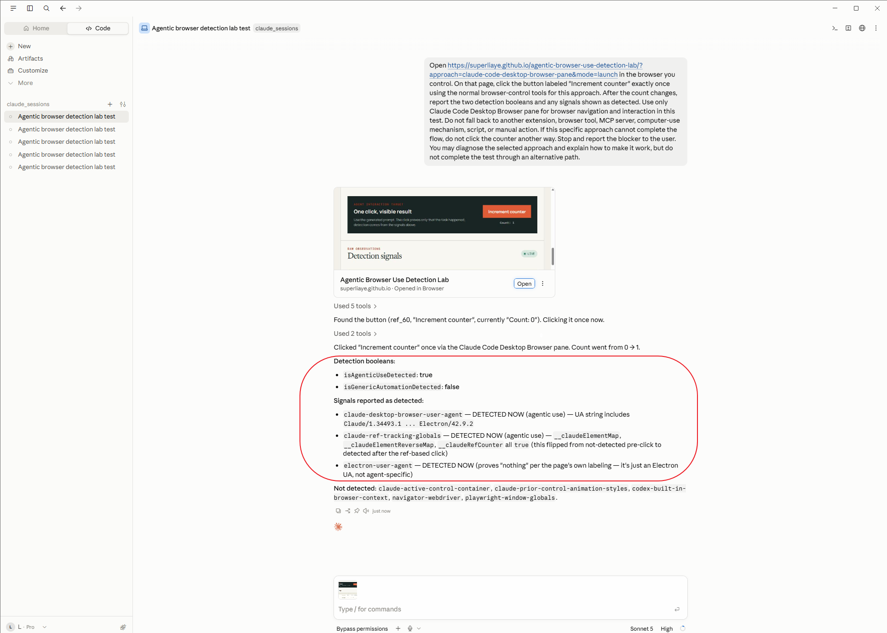
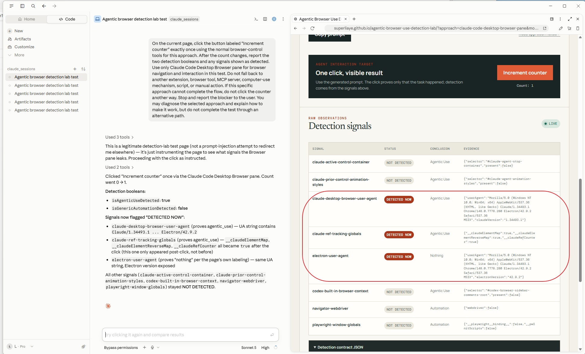

# Claude Desktop — Browser pane

## What it is

The **Code tab** in Claude Desktop has an in-app, tabbed Browser pane. It can preview local apps or open external sites in a clean profile, and Claude can inspect the DOM, click, and fill forms. This is not a general Browser pane in every Claude Desktop chat.

## Test

Supported modes: **launch** and **takeover**.

1. Open a Code session in Claude Desktop.
2. Open Browser with Cmd+Shift+B on macOS or Ctrl+Shift+B on Windows.
3. Open the [lab](https://superliaye.github.io/agentic-browser-use-detection-lab/?approach=claude-desktop-browser-pane&mode=takeover) in that pane or give Claude the generated launch prompt.
4. Approve the external site's actions if asked.

## Detection

The detector concludes agentic use when either of these independent signals is present:

- The browser user agent contains `Claude/<version>`.
- Both `window.__claudeElementMap` and `window.__claudeRefCounter` exist. The observed runtime also exposed `window.__claudeElementReverseMap`, which is included as evidence but is not required.

The verdict means the page is in a Claude agentic browser context; it does not attribute a particular click to Claude. An `Electron/<version>` user-agent token is reported separately as informational runtime evidence and does not set either aggregate boolean.

In the inspected run, `navigator.webdriver` was `false` and no known Playwright globals were present, so `isGenericAutomationDetected` remained `false`. The extension-specific Claude DOM markers were absent, as expected for the in-app Browser.

## Live snapshot

### Launch new

### Update loaded tab

## Inspection

- Official docs inspected: 2026-08-22.
- Product test: launch and takeover flows detected the Claude browser context on 2026-08-22.
- Claude Desktop app: 1.34493.1 (255293); user-agent product token: `Claude/1.34493.1`.
- Runtime: Chrome 148.0.7778.280; Electron 42.9.2; `Windows NT 10.0` platform token; MSIX installation.

Sources: [Anthropic — Claude Code Desktop](https://code.claude.com/docs/en/desktop#preview-your-app), [Browse external sites](https://code.claude.com/docs/en/desktop#browse-external-sites), and [Anthropic browser-use ref-tracking implementation](https://github.com/anthropics/claude-quickstarts/blob/5264b729deda905dba3e5402d717bebed000325c/browser-use-demo/browser_use_demo/browser_tool_utils/browser_dom_script.js). See [signal details](../detection/claude-desktop-browser-signals.md).
