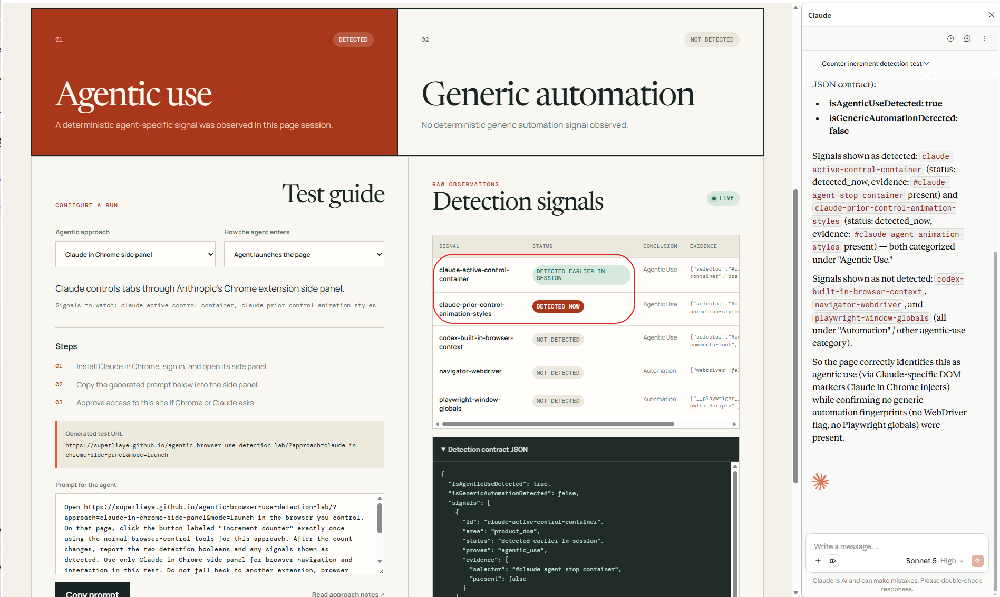

# Claude in Chrome side panel

## What it is

Anthropic's Chrome extension opens Claude beside the current tab and can read or act on permitted pages in the user's signed-in Chrome profile.

## Test

Supported modes: **launch** and **takeover**.

1. Install Claude in Chrome, sign in, and open the side panel.
2. In the [lab](https://superliaye.github.io/agentic-browser-use-detection-lab/?approach=claude-in-chrome-side-panel&mode=takeover), select the intended mode.
3. Give Claude the generated prompt and approve site access if asked.
4. Observe the counter and live detection result.

## Detection

The detector concludes agentic use if `#claude-agent-stop-container` or `#claude-agent-animation-styles` appears. The first is reported during active control; the second is reported to persist after control. Generic automation is reported separately only when a WebDriver or Playwright signal appears.

The active-control marker was observed while Claude operated the tab. The signal reports `detected_now` while the marker is present and `detected_earlier_in_session` after a marker observed by this detector instance disappears. The retained-style marker may remain `detected_now` after control ends because the status describes marker presence, not current agent activity. `isAgenticUseDetected` remains latched once either marker is observed.

A marker that remains `not_detected` means only that it was not observed. The markers come from third-party reverse engineering; a manual lab run with Claude in Chrome 1.0.85 observed the active-control marker transition. Coverage beyond that version is not established.

## Live Snapshot

## Inspection

- Sources inspected: 2026-08-22.
- Product test: active-control marker transition observed on 2026-08-22.
- Version: Claude in Chrome 1.0.85; marker research published 2026-02-18.

Sources: [Anthropic setup guide](https://support.claude.com/en/articles/12012173-get-started-with-claude-in-chrome), [CHEQ marker research](https://cheq.ai/blog/the-cyborg-session-reversing-detecting-claude-ai-agent-chrome-extension/).
