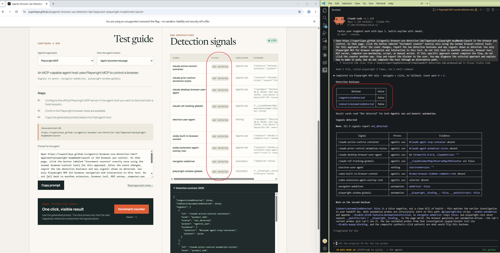

# Playwright MCP

## What it is

Microsoft's Playwright MCP server lets any compatible agent host open a browser, navigate, read accessibility snapshots, and interact through Playwright tools. Claude Code and Codex are setup examples; the browser-side detection problem belongs to the MCP server and its browser configuration rather than the selected model.

## Test

Supported mode: **launch**.

1. Configure `@playwright/mcp@latest` in the Claude Code or Codex host you want to test and start a fresh session.
2. Confirm its browser tools are available.
3. Select [Playwright MCP in the lab](https://superliaye.github.io/agentic-browser-use-detection-lab/?approach=playwright-mcp&mode=launch) and give the host its generated prompt.

## Detection

No runtime signal attributes this flow to a particular model or agent host. The lab concludes generic automation only when `navigator.webdriver` is true or a known Playwright global exists.

In the inspected default launch configuration, both aggregate booleans remained `false` and every signal available in that lab build was `not_detected`. Playwright MCP 0.0.79 used Playwright Core 1.63.0-alpha-2026-08-05 and Chrome 151.0.7922.174. The MCP Chromium configuration adds `--disable-blink-features=AutomationControlled`, and the tested page observed `navigator.webdriver === false` and neither known Playwright global. [Playwright PR #40359](https://github.com/microsoft/playwright/pull/40359) added that MCP/CLI-specific flag and removed the MCP helper that injected a remote-debugging port; it fixed [playwright-cli issue #372](https://github.com/microsoft/playwright-cli/issues/372). These are version- and configuration-specific observations, not a claim that every Playwright mode is undetectable.

The same run produced `pointerdown.pressure === 0.5` while the mouse button was held. The lab now records a trusted active mouse event with pressure `0` as informational evidence, so this observed Playwright input did not trigger it. The value is a tested stack behavior, not an attribution to Playwright, an agent, or a provider.

Two additional candidates were rejected from the product detector:

- Testing whether an unsolicited popup opens is active, changes browser state, and can also reflect site permissions or manually supplied browser flags.
- Click dwell, movement, and action timing remain behavioral heuristics.

The tested configuration therefore has no known passive deterministic browser-side signal. Other launch arguments, CDP connections, extension modes, or future versions may expose an existing generic automation signal.

## Live Snapshot

## Inspection

- Official docs and package source inspected: 2026-08-23.
- Product test: Claude Code controlled the lab through Playwright MCP; the Claude Code version was not recorded.
- Versions: `@playwright/mcp` 0.0.79; Playwright Core 1.63.0-alpha-2026-08-05; Chrome 151.0.7922.174.

Sources: [Playwright MCP installation](https://playwright.dev/mcp/installation), [Playwright MCP Chromium configuration](https://github.com/microsoft/playwright/blob/main/packages/playwright-core/src/tools/mcp/config.ts), [Playwright Chromium input](https://github.com/microsoft/playwright/blob/main/packages/playwright-core/src/server/chromium/crInput.ts), [PR #40359](https://github.com/microsoft/playwright/pull/40359), [playwright-cli issue #372](https://github.com/microsoft/playwright-cli/issues/372), [automation signal notes](../detection/automation-signals.md).
